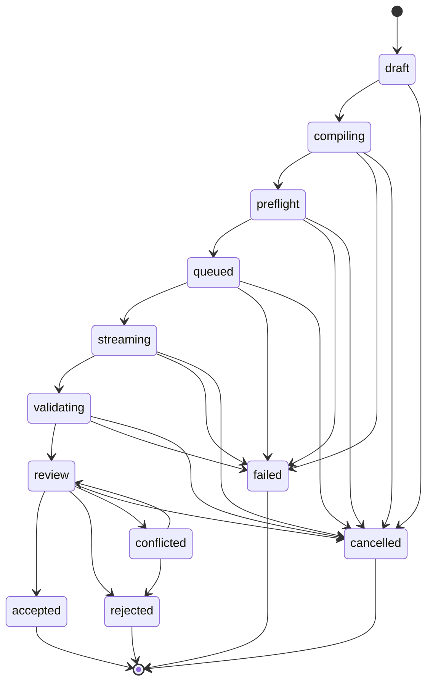

# @optimizer/kernel

> 对应版本 v0.2.0

## 定位

领域内核：实现操作生命周期有限状态机、领域错误模型与稳定 JSON 序列化，是 operation-runner / patch-engine / 桌面宿主共享的纯逻辑层。

## 包结构

- `src/index.ts`：单一入口，re-export 全部子模块。
- `src/operation-state-machine.ts`：操作生命周期 FSM 与迁移合法性检查。
- `src/errors.ts`：`DomainError` 错误模型与分类。
- `src/context-compiler.ts`：上下文编译器（基于 `ContextTier` / `Authority` / `Sensitivity` 等策略筛选与排序上下文项）。
- `src/profiles.ts`：操作 profile（按 `OperationType` × `OperationStrength` 输出参数与策略）。
- `src/ports.ts`：端口抽象（向 operation-runner / model-gateway 暴露的接口契约）。
- `src/stable-json.ts`：稳定 JSON 实现（与 `@optimizer/protocol` 对齐）。
- `test/`：`operation-state-machine.test.ts` 与 `context-compiler.test.ts`。

## 主要导出

### `src/operation-state-machine.ts`

- `OperationTransition`：迁移记录类型，包含 `from` / `to` / `occurredAt` / `reason?`。
- `canTransition(from: OperationState, to: OperationState): boolean`：状态迁移合法性检查函数，依据内置 `transitions` 表判定。
- `OperationLifecycle`：操作生命周期 FSM 类。构造时接受初始状态（默认 `draft`），通过 `transition(to, occurredAt, reason?)` 推进状态，非法迁移抛出 `DomainError`（code `OPERATION_INVALID_TRANSITION`，category `conflict`）。`history` 字段以不可变副本形式记录全部迁移。

### `src/errors.ts`

- `DomainErrorCategory`：`user_action` / `policy` / `validation` / `provider_transient` / `provider_permanent` / `storage` / `conflict` / `internal`。
- `DomainError`：继承 `Error`，携带 `code` / `category` / `retryable`（默认 `false`）/ `details` 字段。`name` 固定为 `"DomainError"`，供上层区分领域错误与系统异常。

## 状态机

状态总数 12，分为非终局（可继续迁移）与终局（不可逆，迁移目标列表为空）两类。

### 非终局状态（8 个）

| 状态 | 含义 |
| --- | --- |
| `draft` | 操作意图已创建，尚未编译 |
| `compiling` | 正在编译上下文包 |
| `preflight` | 编译完成，准备入队 |
| `queued` | 已入队等待 provider 接收 |
| `streaming` | provider 正在流式返回 |
| `validating` | 流结束，正在校验产物 |
| `review` | 等待用户审阅 |
| `conflicted` | 检测到冲突，可在修复后回到 `review` |

### 终局状态（4 个，不可逆）

| 状态 | 含义 |
| --- | --- |
| `accepted` | 用户接受补丁，已落地 |
| `rejected` | 用户拒绝补丁 |
| `failed` | 流程异常终止（含 provider 错误） |
| `cancelled` | 用户或系统主动取消 |

### 迁移图



### v0.2.0 迁移扩展

相对 v0.1.0，新增以下两条取消迁移，使用户在产物校验与审阅阶段也能主动取消操作，而无需先失败再清理：

- `validating` → `cancelled`
- `review` → `cancelled`

`conflicted` 状态保持非终局语义：仅允许回到 `review`（修复后再次审阅）或推进到 `rejected`（放弃修复）。

## 依赖关系

- 依赖 `@optimizer/protocol`（通过相对路径 `../../protocol/src/index.ts` 导入 `OperationState` 等类型）。
- 被以下包消费：`packages/operation-runner`、`packages/patch-engine`、`apps/optimizer-desktop`（间接），以及 Rust 侧通过 schema 对齐的消费方。
- 本包无第三方运行时依赖。

## 开发命令

```pwsh
# 在 packages/kernel 目录下
node --test                                # 运行 test/ 目录下的所有测试
node --test test/operation-state-machine.test.ts
node --test test/context-compiler.test.ts
```
